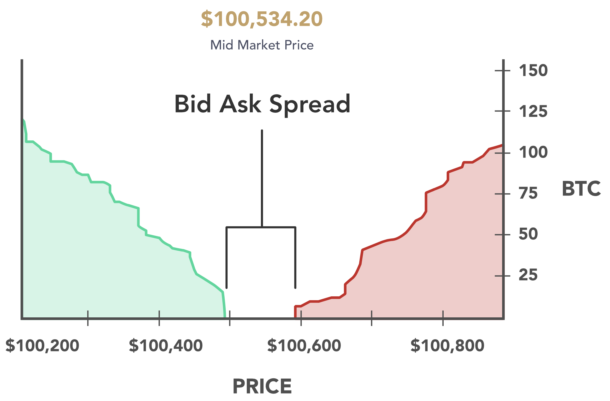

# Lecture 0: What is Economics

**Instructor:** Fei Tan

 @econdojo &nbsp;&nbsp;&nbsp;&nbsp;  @BusinessSchool101 &nbsp;&nbsp;&nbsp;&nbsp;  Saint Louis University

**Course:** Macroeconomics 201  
**Date:** August 21, 2025

---

## The Road Ahead

1. [What is Economics](#what-is-economics-about)
2. [Understanding the Market](#what-is-market)

---

## What Is Economics About?

- A subject about how people make choices to attain their goals, given scarce resources
  - e.g. study economics midterm or go to party tonight?

- **Why an important subject**
  - basic fact of life: we face trade-offs because we live in a world of scarcity

- Main references
  - **HO**: Hubbard & O'Brien, "*Macroeconomics*", 9th Edition (required)
  - **BJ**: Blanchard & Johnson, "*Macroeconomics*", 6th Edition (optional), see my lecture notes

---

## Three Key Ideas

- People are rational
  - use all available information to make best decision possible

- People respond to economic incentives
  - e.g. few banks take costly security measures against not so costly robberies

- Optimal decisions are made at margin
  - optimality occurs when marginal cost (MC) equals marginal benefit (MB)

---

## Three Fundamental Questions

- **What** goods and services to produce
  - opportunity cost: highest-valued alternative given up
  - e.g. funding for space exploration or cancer research

- **How** to produce goods and services
  - e.g. use more workers or more machines

- **Who** receive goods and services produced
  - e.g. people with higher incomes obtain more
  - changes in tax/welfare policy redistribute income

---

## Economic Models

- What is a model
  - *probabilistic* characterization for what we observe
  - help guide our decision-making

- Steps to build economic models/theories
  - decide on assumptions/simplications
  - formulate testable hypothesis
  - use data to test hypothesis
  - revise or retain model

- Micro models study individual choices; macro models study economy as a whole

---

## What Is Market?

---

## Shifts in Demand

---

## Shifts in Supply

---

## Bid-Ask Spread

---

## Options

---

## Japanese Candlestick

---

## Candlestick Patterns

---

## Supply & Demand Zones

---

## /ES Weekly Chart

---

## UNG Daily Chart

---

## UNG Hourly Chart

---

## Useful Tickers

- Stocks
  - S&P 500: SPX, /ES, /MES, SPY, UPRO
  - Nasdaq: NDX, /NQ, /MNQ, QQQ, TQQQ
  - Dow Jones: DJI, /YM, /MYM, DIA, UDOW
  - Russell: RUT, /RTY, /M2K, IWM, URTY

- Bonds: TNX, /TN, /10Y, TLT
- Commodities: gold (/GC, /MGC, GLD), crude oil (/CL, /MCL, USO)
- Currencies: forex (/6E, /M6E, /6J, /M6J, /6B, /M6B), crypto (/BTC, /MBT, GBTC)

---

## Readings & Exercises

- Readings
  - HO: chapter 1
  - *Japanese Candlestick Charting Techniques*, by Steve Nison
  - *Reminiscences of a Stock Operator*, by Edwin Lefèvre & Roger Lowenstein
  - *Principles for Dealing with the Changing World Order: Why Nations Succeed or Fail*, by Ray Dalio

- Exercises
  - HO: problem 1.3, 1.4, 3.3
