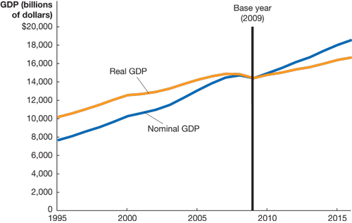

# Lecture 1: Total Production and Income

**Instructor:** Fei Tan

 @econdojo &nbsp;&nbsp;&nbsp;&nbsp;  @BusinessSchool101 &nbsp;&nbsp;&nbsp;&nbsp;  Saint Louis University

**Course:** Macroeconomics 201  
**Date:** August 21, 2025

---

## The Road Ahead

1. [GDP Measures Total Production](#gdp-measures-total-production)
2. [Components of GDP](#components-of-gdp)
3. [Real versus Nominal GDP](#real-versus-nominal-gdp)
4. [National Income Accounting](#national-income-accounting)

---

## How to Measure Total Production?

- **Gross domestic product (GDP)**: most common measure of aggregate economic activity
  - GDP measures market values, not quantities
  - GDP includes final goods and services, not intermediate (e.g. tire v.s. truck)
  - GDP includes current production (typically one year), not used

- **An important identity**

production = expenditure = national income

- GDP/GNP are only approximate measures of above

---

## Calculating GDP

| Product | Quantity | Price per Unit |
|---------|----------|---------------|
| Eye examinations | 100 | $50.00 |
| Pizzas | 80 | $10.00 |
| Shoes | 20 | $100.00 |
| Cheese | 80 | $2.00 |

- Assume all cheese is used to produce pizzas
- Calculate GDP for this simple economy
$$100\times\$50+80\times\$10+20\times\$100=\$7800$$

---

## Calculating GDP (Cont'd)

- Value added: market value firm adds to product
- Final selling price = sum of values added at each stage

---

## Shortcomings of GDP

- As measure of total production, GDP ignores
  - household production, e.g. childcare
  - underground economy, e.g. drugs

- As measure of well-being, GDP ignores
  - value of leisure
  - negative effects of production, e.g. pollution
  - social problems, e.g. crime
  - income distribution

---

## Components of GDP

- Bureau of Economic Analysis (BEA) divides GDP into four categories of expenditures
  - consumption (C): expenditure by consumers
  - actual investment (I): expenditure by firms, including unplanned changes in inventories
  - government purchases (G): expenditure by gov't, not including transfer payments
  - net exports (NX): net expenditure by foreigners, exports (EX) $-$ imports (IM)

- **National income identity**

$$\underbrace{Y}_{\text{GDP}}=\underbrace{C+I+G}_{\text{domestic expenditure}}+\underbrace{EX-IM}_{\text{net foreign expenditure}}$$

---

## Components of GDP (Cont'd)

- Components of GDP in 2016 (source: BEA)
- Consumption is largest component of U.S. GDP

---

## Real versus Nominal GDP

- BEA calculates two values of GDP
  - nominal GDP: value of final goods and services evaluated at **current-year** prices
  - real GDP: value of final goods and services evaluated at **base-year** prices, e.g. chained (2009) dollars
- Real GDP separates price changes from quantity changes
- How to measure average price level

$$\text{GDP deflator}=\frac{\text{nominal GDP}}{\text{real GDP}}\times 100$$

- Why achieving price stability is important

---

## Calculating Real GDP

| Product | 2009 Quantity | 2009 Price | 2020 Quantity | 2020 Price |
|---------|---------------|------------|---------------|------------|
| Eye examinations | 80 | $40 | 100 | $50 |
| Pizzas | 90 | $11 | 80 | $10 |
| Shoes | 15 | $90 | 20 | $100 |

- Assume base year is 2009
- Calculate real & nominal GDP for year 2020
$$\text{real:}\quad 100\times\$40+80\times\$11+20\times\$90=\$6680$$
$$\text{nominal:}\quad 100\times\$50+80\times\$10+20\times\$100=\$7800$$
- GDP deflator for 2020: $7800/6680\times 100\approx 116.77$

---

## Real versus Nominal GDP (Cont'd)

- Real and nominal GDP, 1995-2016 (source: BEA)
- Base year: real GDP = nominal GDP, GDP deflator = 100

---

## National Income Accounting

- Methods to track total production/income, summarized in National Income and Product Accounts (NIPA)
  - Gross National Product (GNP): production by a nation's citizens, including overseas
  - National Income: GDP minus depreciation
  - Personal Income: income received by households, including gov. transfer, excluding firms' retained earnings
  - Disposable Personal Income: personal income minus personal tax payments

---

## National Income Accounting (Cont'd)

- Measures of total production/income, 2016 (source: BEA)

---

## Readings & Exercises

- Readings
  - HO: chapter 8
  - BJ: lecture 1 (sec. 1, 6), 2 (sec. 1) (supplementary)
- Exercises
  - HO: problem 1.4, 1.11, 3.4, D8.1
