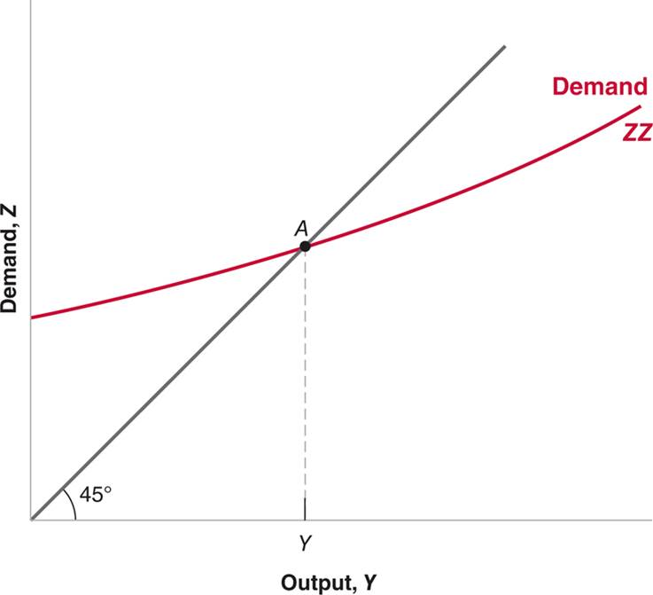
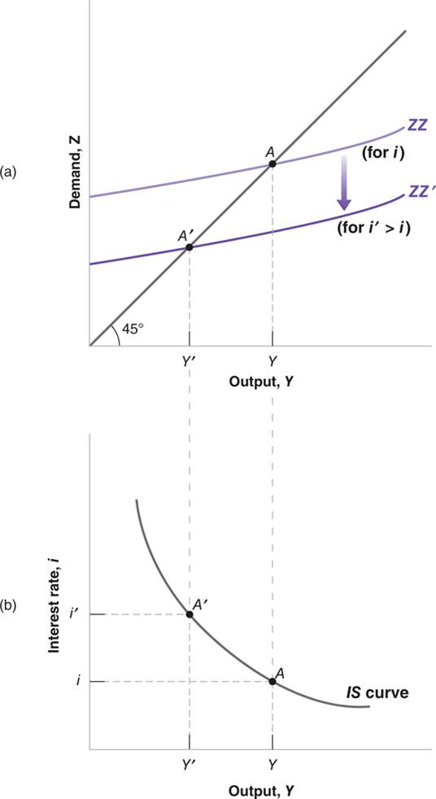
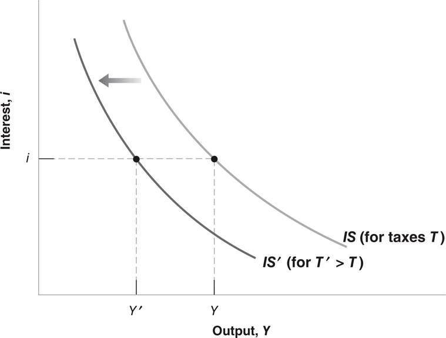
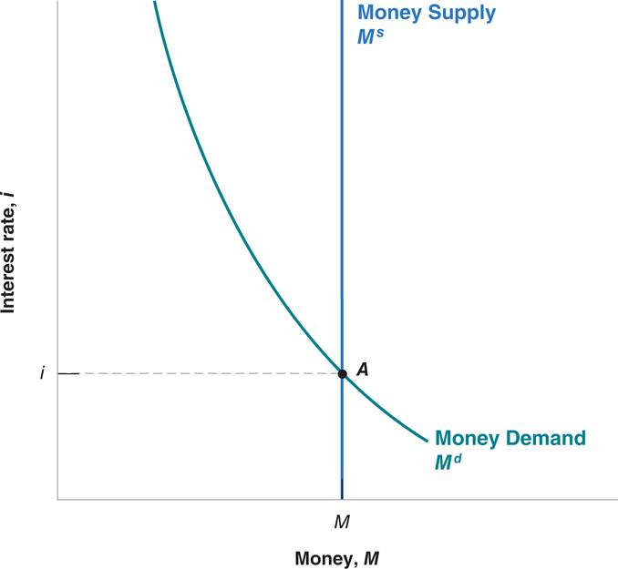
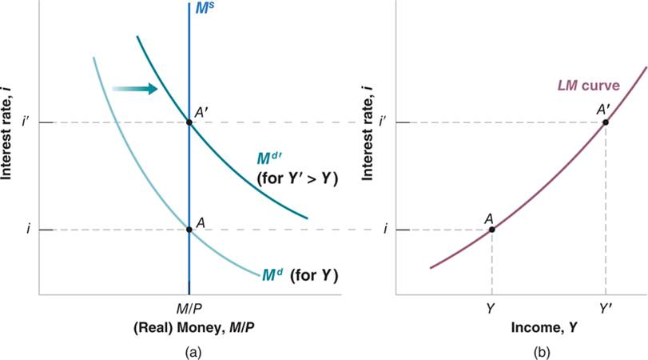
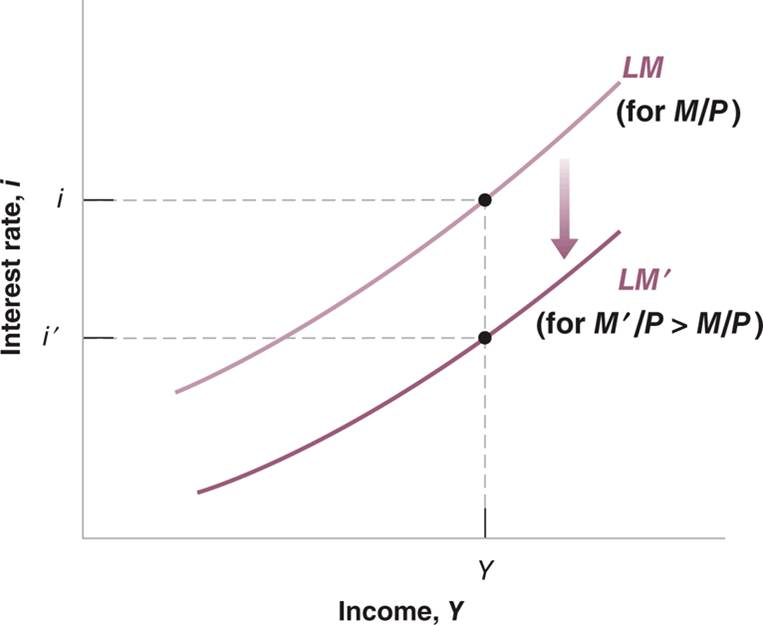
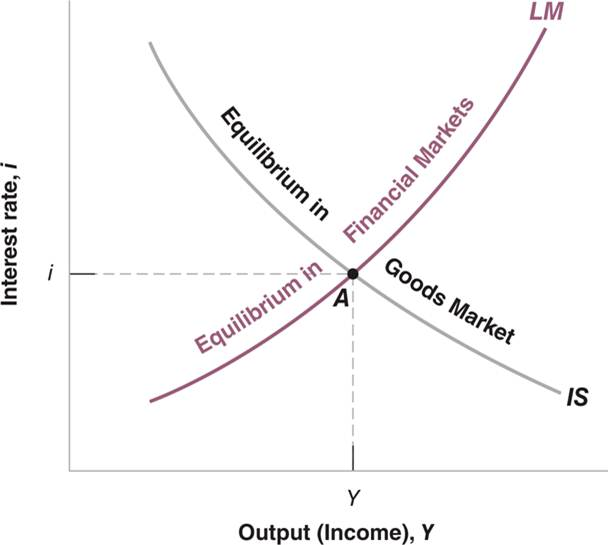
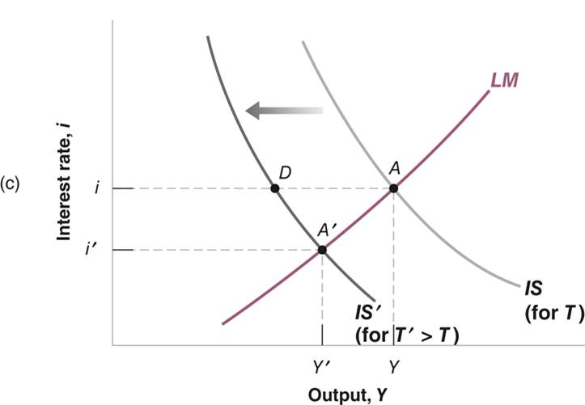
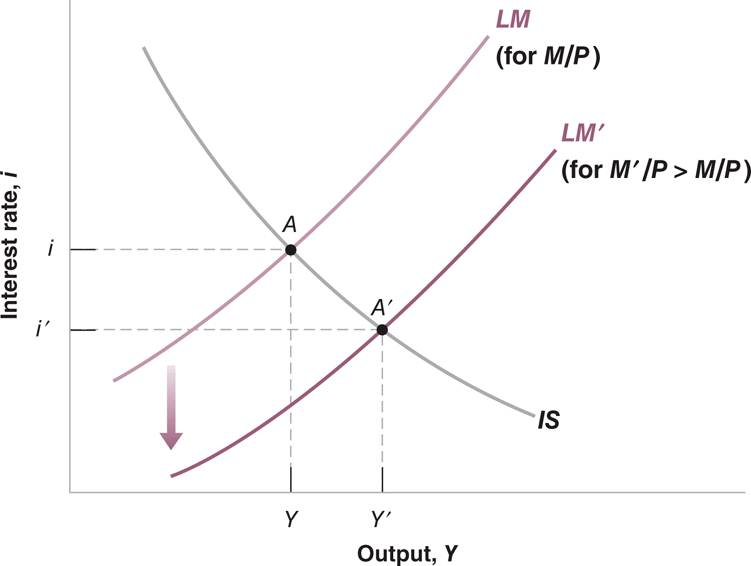

# Lecture 9: IS-LM Model

**Instructor:** Fei Tan

 @econdojo &nbsp;&nbsp;&nbsp;&nbsp;  @BusinessSchool101 &nbsp;&nbsp;&nbsp;&nbsp;  Saint Louis University

**Course:** Macroeconomics 101  
**Date:** October 25, 2025

---

## The Road Ahead

1. [Goods Market and IS Relation](#goods-market-equilibrium-revisited)
2. [Financial Market and LM Relation](#financial-market-equilibrium-revisited)  
3. [IS-LM Model](#is-lm-model)

---

## Goods Market Equilibrium Revisited

### IS relation: $(Y,i)$

$$\underbrace{Y}_{\text{GDP}}=\underbrace{C(Y-T)+I(Y,i)+G+NX}_{\text{aggregate expenditure (AE)}}$$

- Investment ($I$) depends on two main factors:

    - level of sales, equal to production ($Y$) under no inventory investment
    - interest rate ($i$), **cost/price of borrowing**

- Some remarks:

    - given $i$, $Y\uparrow$ $\Rightarrow$ $(C,I)\uparrow$ $\Rightarrow$ AE $\uparrow$
    - empirics: $Y\uparrow$ $\Rightarrow$ $C+I\uparrow$ less than one for one

---

## Equilibrium $Y$ Given $i$

---

## Deriving IS Curve

---

## Shift of IS Curve

- Given $i$, $T\uparrow$ $\Rightarrow$ $C\downarrow$ $\Rightarrow$ $Y\downarrow$ through multiplier
- IS curve shifts to left

---

## Financial Market Equilibrium Revisited

### LM relation: $(Y,i)$

$$M^s=M^d=\$Y\times L(i)\quad\Rightarrow\quad\frac{M^s}{P}=\frac{M^d}{P}=Y\times L(i)$$

- Money demand ($M^d$) depends on two main factors:

    - level of transactions, assumed to be proportional to nominal GDP ($\$Y$)
    - nominal interest rate ($i$) on bonds, hence **opportunity cost/price of holding money**

- Notations:

    - $P$ = price level, e.g. GDP deflator/CPI
    - $M^s/P$ = real money supply
    - $M^d/P$ = real money demand

---

## Equilibrium $i$ Given $Y$

---

## Deriving LM Curve

---

## Shift of LM Curve

- Given $(Y,P)$, $M^s\uparrow$ $\Rightarrow$ $M^s/P>M^d/P$ $\Rightarrow$ $i\downarrow$
- LM curve shifts down

---

## IS-LM Model

---

## Effects of Fiscal Contraction

- Fiscal contraction/consolidation: decrease in $G-T$
- Consider $T\uparrow$ $\Rightarrow$ IS curve $\leftarrow$, LM curve unchanged
- In equilibrium, $Y\downarrow$, $i\downarrow$ (Explain!)

---

## Effects of Monetary Expansion

- Monetary expansion: increase in $M^s$ (How?)
- $M^s\uparrow$ $\Rightarrow$ IS curve unchanged, LM curve $\downarrow$
- In equilibrium, $Y\uparrow$, $i\downarrow$ (Explain!)

---

## Readings & Exercises

- Readings
  
  - BJ: lecture 4

- Exercises
  
  - Graphically illustrate effects of fiscal expansion or monetary contraction on equilibrium output and interest rate. EXPLAIN your results.