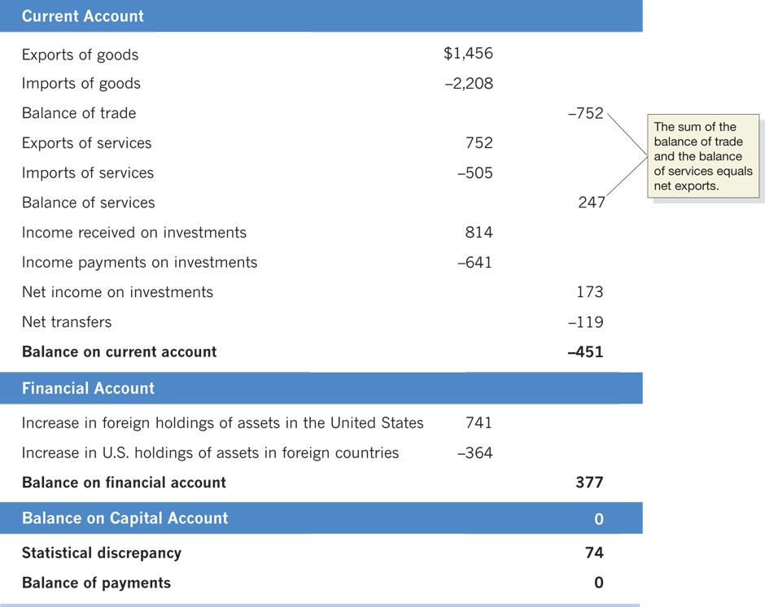
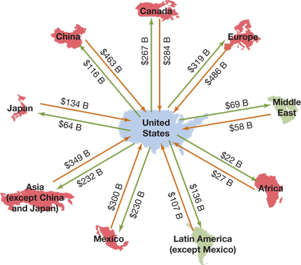
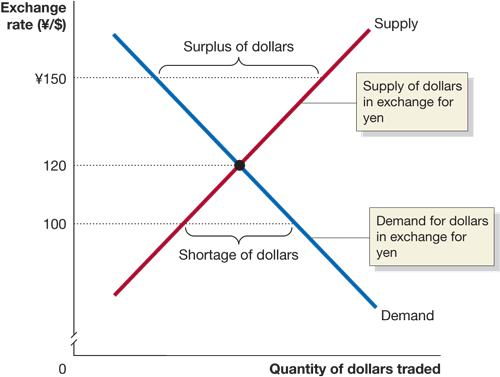
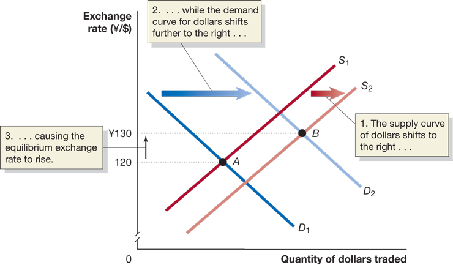
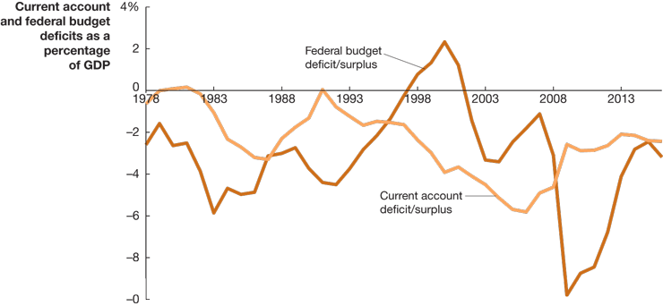

# Lecture 11: Macroeconomics in Open Economy

**Instructor:** Fei Tan

 @econdojo &nbsp;&nbsp;&nbsp;&nbsp;  @BusinessSchool101 &nbsp;&nbsp;&nbsp;&nbsp;  Saint Louis University

**Course:** Macroeconomics 101  
**Date:** October 25, 2025

---

## The Road Ahead

1. [Balance of Payments](#balance-of-payments)
2. [Exchange Rates and Foreign Exchange Market](#nominal-exchange-rate)
3. [National Saving and Investment](#saving-equals-investment-revisited)
4. [Monetary and Fiscal Policy](#monetary-and-fiscal-policy)

---

## Balance of Payments

- A set of accounts recording a country's international transactions, compiled by BEA

  - **current account** = trade balance (net exports) + income balance + net unilateral transfers
  - **financial account** = sales of assets to foreigners $-$ purchases of assets from foreigners
  - **capital account**: quantitatively small in U.S.

- Principle of double-entry bookkeeping

  - current acc't balance = $-$ financial acc't balance

- Example
  
  - a U.S. resident buys a smartphone of $500 from South Korea with dollars (U.S. asset)
  - current acc't ↓ $500, financial acc't ↑ $500

---

## U.S. Balance of Payments, 2016

- Source: BEA, billions of dollars

- Large deficits in trade balance and current account

---

## U.S. Trade Flows, 2016

- Green arrows: exports, red arrows: imports

---

## Nominal Exchange Rate

- Value of one currency in terms of another

  - how much yen is one dollar? (¥100/$)
    ⇒ **price** of domestic currency in foreign currency
  - how much dollar is one yen? ($0.01/¥)
    ⇒ **price** of foreign currency in domestic currency

- This course: foreign price of domestic currency

- Why is it important
  
  - comparing prices in different countries becomes easy
  - $22,000 Ford v.s. ¥2,500,000 Nissan
  - ¥2,500,000 "=" $2,500,000 × 0.01

---

## Changes in Exchange Rates

- Currency depreciation: decrease in value of one currency **relative** to another

  - $1/€ ↑ $1.2/€: $ becomes less valuable relative to €
  - $0.01/¥ ↓ $0.012/¥: Nissan costs more as $ depreciates
  - price of exports ↓ relative to price of imports

- Currency appreciation: increase in value of one currency **relative** to another

- Domestic currency depreciates (appreciates) ⇔ foreign currency appreciates (depreciates)

---

## Foreign Exchange Market Equilibrium

- Equilibrium occurs when dollar supply equals demand

- Fixed exchange rates are not determined by market

---

## Shifts in Demand and Supply

- Demand shifters: foreign income, domestic interest rate, expected value of home currency

- Supply shifters: domestic income, foreign interest rate, expected value of foreign currency

---

## Real Exchange Rate

### Purchasing Power Parity (PPP)

$$P^*=E\times P\quad \text{(no arbitrage)}$$

- Some notations

  - $P$ = domestic price of a basket of goods
  - $P^*$ = foreign price of a basket of goods
  - $E$ = foreign price of domestic currency

- What is real exchange rate?

  - **price** of domestic goods in foreign goods

    

    $$e=E\times P/P^*$$

    

  - PPP condition holds if $e=1$

---

## Saving Equals Investment Revisited

### National income identity

$$\underbrace{S}_{\text{national saving}}=\underbrace{Y-T-C}_{\text{private saving}}+\underbrace{T-G}_{\text{gov't saving}}=I+NX$$

- Some notations

  - $T$ = taxes net of transfers (net taxes)
  - $Y-T$ = disposable income
  - $S^p$ = private saving, $S^g$ = gov't (public) saving
  - $G-T$ = primary deficit/newly issued gov't debt

- Ways to raise national wealth
  
  - Closed economy: only domestic investment ($S=I$)
  - Open economy: also net foreign investment ($NX$)

---

## Twin Deficits

- Effects of government budget deficit: $S↓$ ⇒ $I↓$ or $NX↓$ (why?)

- $G-T↑$ ⇒ U.S. bond supply ↑ ⇒ $i↑$ ⇒ $I↓$
- $i↑$ ⇒ dollar demand ↑ ⇒ $E↑$ ⇒ $NX↓$

---

## Monetary and Fiscal Policy

- Monetary policy in open economy
  
  - consider monetary expansion ($M^s↑$ ⇒ $i↓$)
  - closed economy: $I↑$, $C↑$
  - open economy: dollar demand ↓ ⇒ $E↓$ ⇒ $NX↑$
  - MP becomes more effective in open economy

- Fiscal policy in open economy
  
  - consider fiscal expansion ($G↑$ or $T↓$ ⇒ $i↑$)
  - closed economy: $I↓$, $C↓$ (crowding out)
  - open economy: dollar demand ↑ ⇒ $E↑$ ⇒ $NX↓$
  - smaller multiplier effect
  - FP becomes less effective in open economy

---

## Readings & Exercises

- Readings
  
  - HO: chapter 18
  - BJ: lecture 16 (supplementary)

- Exercises
  
  - HO: problem 1.3, 2.1, 2.9, 3.9, D18.1
  - Graphically compare effects of monetary or fiscal expansion on equilibrium output in closed and open economy. EXPLAIN your results.