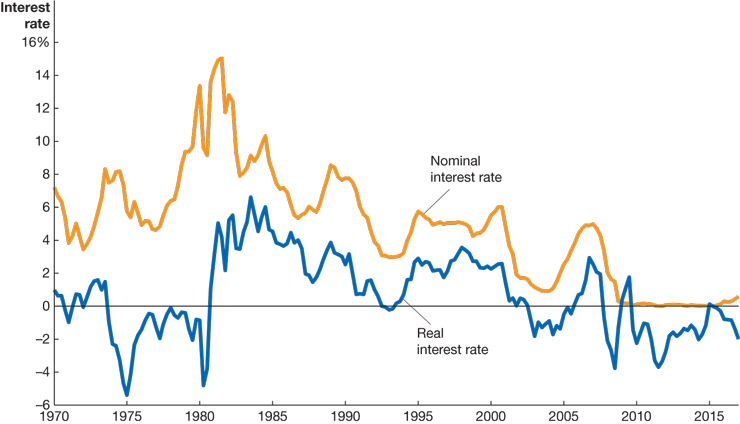

# Lecture 2: Unemployment, Inflation, and Interest Rate

**Instructor:** Fei Tan

 @econdojo &nbsp;&nbsp;&nbsp;&nbsp;  @BusinessSchool101 &nbsp;&nbsp;&nbsp;&nbsp;  Saint Louis University

**Course:** Macroeconomics 201  
**Date:** September 1, 2025

---

## The Road Ahead

1. [Measuring Unemployment](#how-to-measure-unemployment)
2. [Measuring Inflation](#how-to-measure-inflation)
3. [Real versus Nominal Interest Rates](#real-versus-nominal-interest-rates)

---

## How to Measure Unemployment?

- Bureau of Census conducts Current Population Survey (CPS) to classify people as
  - **employed (N)**: people who have job
  - **unemployed (U)**: people who don't have job but are actively looking for one
  - **not in labor force**: neither, e.g. discouraged worker

- Bureau of Labor Statistics (BLS) uses CPS data to calculate
  - **labor force (L)** = N + U
  - **unemployment rate (u)** = U / L × 100% (series U-3)
  - **participation rate** = L / working-age population (civilian noninstitutional population) × 100%

---

## Working-Age Population

- Employment status, April 2017 (source: BLS)

---

## Broader Measure of Unemployment

- Series U-6 = U-3 + discouraged + part-time (source: BLS)
- Official U-3 is not exact measure of joblessness

---

## Types of Unemployment

- We identify three types of unemployment
  - **frictional**: temporary unemployment due to process of matching workers with jobs
  - **structural**: longer unemployment due to mismatch b/w worker's skills/attributes and job requirements
  - **cyclical**: unemployment due to business cycle recession

- When cyclical unemployment drops to zero
  - economy is at full employment
  - natural rate of unemployment ($u_n$)
  - general consensus for U.S.: b/w 4% and 5%

- Why unemployment rate never falls to zero?

---

## U.S. Unemployment Rate

- U.S. unemployment rate, 1950-2016 (source: BLS)
- $u$ rises during recessions and falls during expansions

---

## How to Measure Inflation

- Three common measures of price level
  - **GDP deflator** (broadest)
  - **consumer price index (CPI)**: price of basket of goods and services purchased by consumer (cost of living)
  - **producer price index (PPI)**: price received by producers of goods and services at all stages of production

- Changes in PPI signifies future movements in CPI

- Inflation rate is percentage increase in price level

$$\pi_t=\frac{P_t-P_{t-1}}{P_{t-1}}\times 100\%$$

---

## CPI Market Basket

- CPI market basket, December 2016 (source: BLS)
- Housing, transportation, and food make up about 75%

---

## Calculating CPI

| Product | 1999 Quantity | 1999 Price | 2020 Price | 2021 Price |
|---------|---------------|------------|------------|------------|
| Eye examinations | 1 | $50 | $100 | $85 |
| Pizzas | 20 | $10 | $15 | $14 |
| Books | 20 | $25 | $25 | $27.5 |

- Assume base year is 1999
- Calculate CPI for year 2020 & 2021

$$\text{CPI}=\frac{\text{expenditures in current year}}{\text{expenditures in base year}}\times 100$$

$$\text{Answer:}\quad P_{2020}=120,\quad P_{2021}=122$$

- 2021 inflation: $\pi_{2021}=(122-120)/120\times 100\%\approx 1.7\%$

---

## Purchasing Power

| Year | Nominal Average Hourly Earnings | CPI (1982-1984=100) |
|------|--------------------------------|---------------------|
| 2020 | $19.73 | 230 |
| 2021 | $20.14 | 233 |
| 2022 | $20.60 | 237 |

- Nominal variables are values in current-year dollars

- Calculate real values for years 2020-2022

$$\text{real variable}=\frac{\text{nominal variable}}{\text{current-year price index}}\times 100$$

$$\text{Answer:}\ W_{2020}=\$8.59,\quad W_{2021}=\$8.65,\quad W_{2022}=\$8.70$$

- Compare growth rates in nominal and real values

---

## Real versus Nominal Interest Rates

- Interest rate is cost of borrowing funds
  - **nominal interest rate ($i$)**: expressed in terms of units of **national currency**; borrowing $1 this year requires repaying $(1+i) next year
  
  → this year's **price** of one dollar relative to next year

  - **real interest rate ($r$)**: expressed in terms of baskets of **goods**; borrowing one basket this year requires repaying $(1+r)$ baskets next year
  
  → this year's **price** of one basket relative to next year

- Borrowers/lenders care about $r$ rather than $i$

- A useful (Fisher) relation

$$r_t\approx i_t-\pi_{t+1}^e\quad \text{for small $i_t$ and $\pi_{t+1}^e$}$$

---

## U.S. Interest Rates

- $i$ = interest rate on 3-month U.S. Treasury bills, $\pi$ = percentage change in CPI (source: FRED)
- *ex-ante* versus *ex-post* real interest rates

---

## Readings & Exercises

- Readings
  - HO: chapter 9
  - BJ: lecture 1 (sec. 2, 3, 4), lecture 5 (sec. 1), 12 (sec. 1) (supplementary)

- Exercises
  - HO: problem 1.7, 3.2, 4.6, 5.5, 6.6, D9.2
  - Derive Fisher relation
