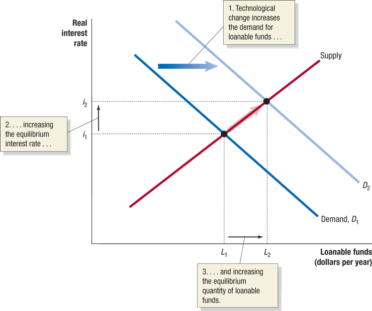

# Lecture 3: Economic Growth, Financial System, and Business Cycles

**Instructor:** Fei Tan

 @econdojo &nbsp;&nbsp;&nbsp;&nbsp;  @BusinessSchool101 &nbsp;&nbsp;&nbsp;&nbsp;  Saint Louis University

**Course:** Macroeconomics 201  
**Date:** September 7, 2025

---

## The Road Ahead

1. [Long-Run Economic Growth](#long-run-economic-growth)
2. [Saving, Investment, and Financial System](#saving-investment-and-financial-system)
3. [Business Cycle](#business-cycle)

---

## What is Economic Growth?

- A process by which rising productivity increases average standard of living

- How to measure average standard of living
  - real GDP **per capita** (most common)
  - production per person, adjusted for inflation

- We measure long-run economic growth by percentage increase in real GDP per capita over long periods

$$\text{growth rate}=\frac{Y_t-Y_{t-n}}{Y_{t-n}}\times 100\%,\quad \text{$n\sim$ decades}$$

---

## U.S. Economic Growth, 1900-2016

- Growth in real GDP per capita (source: BEA)
- Average American can buy more than 8 times now

---

## Calculating Growth Rates

- Growth rate over long periods
  - annual growth rates: $g_1,g_2,\ldots,g_n$

    

    $$Y_{t-n}\times(1+g_1)\times(1+g_2)\times\cdots\times(1+g_n)=Y_t$$

    

  - average annual growth rate: $g$

    

    $$Y_{t-n}\times(1+g)^n=Y_t$$

    

  - A useful approximation: for small $n$

    

    $$g\approx\frac{g_1+g_2+\cdots+g_n}{n}$$

    

- Rule of 70: $\text{number of years to double}=\frac{70}{g}$

---

## What Determines Growth Rates?

- Labor productivity: quantity of goods and services produced by one worker or one hour of work

- What determines labor productivity
  - increases in capital per hour worked
  - technological change

- Potential GDP: level of real GDP attained when all firms are operating at capacity
  - "normal" hours & "normal" sized workforce
  - U.S. potential GDP: average annual rate of 3.2%

---

## Actual versus Potential GDP

- U.S. actual and potential GDP (source: FRED)
- Actual GDP falls below potential during recessions

---

## What is Financial System?

- A system through which firms acquire funds from households
  - financial markets, e.g. bond/stock markets
  - financial intermediaries, e.g. banks, mutual funds

- Three key services of financial system
  - risk-sharing: portfolio diversification
  - liquidity: ease with which financial security can be exchanged for money
  - information: facts about borrowers and expected returns on financial securities

---

## Saving Equals Investment

**National income identity**

$$\underbrace{S}_{\text{national saving}}=\underbrace{Y-T-C}_{\text{private saving}}+\underbrace{T-G}_{\text{gov't saving}}=I+NX$$

- Some notations
  - $T$ = taxes net of transfers (net taxes)
  - $Y-T$ = disposable income
  - $S^p$ = private saving, $S^g$ = gov't (public) saving
  - $G-T$ = primary deficit/newly issued gov't debt

- Ways to raise national wealth
  - Closed economy: only accumulate capital ($S=I$)
  - Open economy: also net foreign investment ($NX$)

---

## Loanable Funds Market

- Assume closed economy; single market for loanable funds
- Loanable funds market determines **real** interest rate

---

## Shift in Demand Curve

- Effect of technological change: real interest rate ↑, loanable funds ↑
- Effects of expected future profits, corporate taxes?

---

## Shift in Supply Curve

- Effect of budget deficit: real interest rate ↑, loanable funds ↓ (higher $G$ crowds out $I$)
- Effects of 401(k) retirement plan?

---

## Idealized vs. Actual Business Cycle

- Alternating periods of expansions and recessions
- $(Y,N)$ ↑ (↓) during expansions (recessions)
- Recession: two consecutive quarters of declining real GDP
- National Bureau of Economic Research (NBER) Business Cycle Dating Committee

---

## Effect of Business Cycle

- Effect of business cycles on inflation (source: BLS)

---

## Effect of Business Cycle (Cont'd)

- Effect of business cycles on unemployment (source: BLS)

---

## Great Moderation

- Annual fluctuations in real GDP (source: BEA)
- Reduction in volatility of business cycles since mid-1980s

---

## Readings & Exercises

- Readings
  - HO: chapter 10
  - BJ: lecture 2 (sec. 4) (supplementary)

- Exercises
  - HO: problem 1.8, 2.7, 2.8, 2.10, D10.1, D10.2
