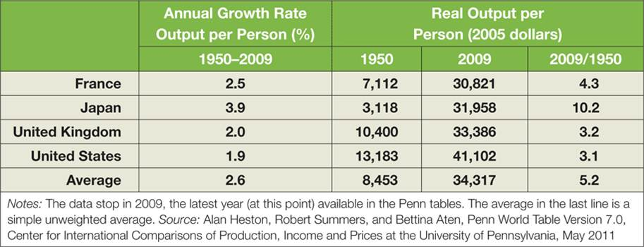
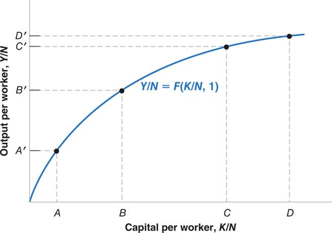
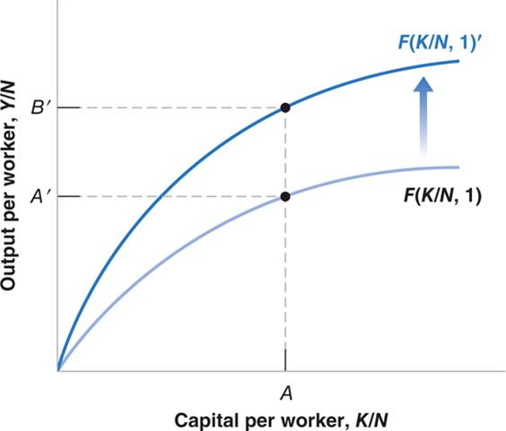

# Lecture 4: Economic Growth Model

**Instructor:** Fei Tan

 @econdojo &nbsp;&nbsp;&nbsp;&nbsp;  @BusinessSchool101 &nbsp;&nbsp;&nbsp;&nbsp;  Saint Louis University

**Course:** Macroeconomics 201  
**Date:** September 13, 2025

---

## The Road Ahead

1. [Measuring Standard of Living](#standard-of-living-revisited)
2. [Economic Growth Model](#economic-growth-model)

---

## Standard of Living Revisited

- Cross-country comparison of standard of living
  - purchasing power parity (PPP) numbers
  - GDP/GDP per capita constructed with common set of prices for all countries
  - downloadable from Penn World Tables

- Why using PPP numbers
  - exchange rate vary a lot
  - systematic differences in prices across countries

- We measure long-run economic growth by percentage increase in PPP numbers over long periods

$$\text{growth rate}=\frac{Y_t-Y_{t-n}}{Y_{t-n}}\times 100\%,\quad \text{$n\sim$ decades}$$

---

## Growth in Rich Countries

- Large increase in output per capita
- Convergence of output per capita across countries

---

## Economic Growth Model

**Aggregate production function**

$$Y=F(K,N)\qquad \text{(e.g. $Y=AN$)}$$

- Notations
  - $Y$ = aggregate output
  - $K$ = aggregate capital
  - $N$ = aggregate employment

- Three assumptions
  - constant returns to scale

  

  $$xY=F(xK,xN)\qquad \text{for any $x$}$$

  

  - decreasing returns to capital & labor

---

## Economic Growth Model (Cont'd)

**Per capita production function**

$$\frac{Y}{N}=F\left(\frac{K}{N},\frac{N}{N}\right)=F\left(\frac{K}{N},1\right)\qquad \text{(set $x=1/N$)}$$

- Notations
  - $Y/N$ = output per capita
  - $K/N$ = capital per capita

- Sources of economic growth
  - capital accumulation
  - technological progress

---

## Capital Accumulation

- Capital accumulation cannot sustain growth (why?)

---

## Technological Progress

- Sustained growth requires sustained technological progress

---

## Readings & Exercises

- Readings
  - HO: chapter 11
  - BJ: lecture 8 (supplementary)

- Exercises
  - HO: problem 2.8, 2.9
  - Let production function be $Y=\sqrt{K}\sqrt{N}$. Compute output when $K=49$ and $N=81$. If capital and labor double, what is output? It is constant returns to scale? Compute $Y/N$ when $K/N=4$.