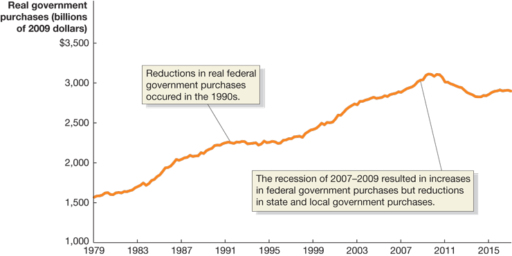

# Lecture 5: Aggregate Expenditure and Output in Short Run

**Instructor:** Fei Tan

 @econdojo &nbsp;&nbsp;&nbsp;&nbsp;  @BusinessSchool101 &nbsp;&nbsp;&nbsp;&nbsp;  Saint Louis University

**Course:** Macroeconomics 201  
**Date:** September 13, 2025

---

## The Road Ahead

1. [Aggregate Expenditure Model](#aggregate-expenditure)
2. [Determinants of Aggregate Expenditure](#determinants-of-consumption)
3. [Graphing Goods Market Equilibrium](#goods-market-equilibrium)
4. [Multiplier Effect](#graphing-multiplier-effect)
5. [Aggregate Demand Curve](#effect-of-price-level-change)

---

## Aggregate Expenditure

- Keynes identified four categories of expenditures

  - **consumption (C):** expenditure by consumers
  - **planned investment (I'):** expenditure by firms (NO unplanned changes in inventories)
  - **government purchases (G):** expenditure by gov't, not including transfer payments
  - **net exports (NX):** net expenditure by foreigners, exports (EX) $-$ imports (IM)

- **Goods market equilibrium/IS relation**

$$\underbrace{Y}_{\text{GDP}}=\underbrace{C+I'+G+NX}_{\text{aggregate expenditure (AE)}}$$

$$\Leftrightarrow\quad\text{actual investment}=\text{planned investment}$$

---

## Aggregate Expenditure Model

- A macro model that determines **short-run** output

  - relation between AE (total spending/demand) and GDP (total production/supply)
  - key assumptions: constant price level & no growth

- How AE model works

  - AE > GDP ⇒ inventories ↓ ⇒ (Y,N) ↑
  - AE < GDP ⇒ inventories ↑ ⇒ (Y,N) ↓
  - AE = GDP ⇒ inventories unchanged ⇒ goods market equilibrium

- GDP fluctuates due to changes in AE

---

## Determinants of Consumption

**Consumption function**

$$C=C(Y_D)=c_0+c_1Y_D,\qquad Y_D=Y-T$$

- Some notations

  - $C$ = consumption
  - $T$ = net taxes (taxes net of transfers)
  - $Y_D$ = disposable income
  - $c_1$ = marginal propensity to consume (MPC)
  - $c_0$ = autonomous consumption

- Other determinants: wealth, expected future income, **real interest rate (price of consumption today relative to tomorrow)**, price level

---

## Consumption Function

- Relation b/w consumption and income (source: BEA)
- MPC = slope of consumption function

---

## U.S. Consumption

- Real consumption, 1979-2017 (source: BEA)
- Consumption follows smooth, upward trend

---

## U.S. Investment

- Real investment, 1979-2017 (source: BEA)
- Investment is subject to larger changes than consumption

---

## U.S. Government Purchases

- Real government purchases, 1979-2017 (source: BEA)
- Government purchases grew steadily in most years

---

## U.S. Net Exports

- Real net exports, 1979-2017 (source: BEA)
- Net exports were negative in most years

---

## Income, Consumption, and Saving

**Marginal propensity to consume/save**

$$\frac{\Delta Y_D}{\Delta Y_D}=\frac{\Delta C}{\Delta Y_D}+\frac{\Delta S}{\Delta Y_D}\quad\Rightarrow\quad 1=\text{MPC}+\text{MPS}$$

- Some remarks

  - $\Delta$ means 'change in'
  - MPC = $\Delta C/\Delta Y_D=\Delta C/\Delta Y$
  - $\Delta S/\Delta Y_D$ = marginal propensity to save (MPS)

- Example: consumption increases from $8,000 to $8,600 as national income increases from $9,000 to $10,000

$$\text{MPC}=\frac{\$8,600-\$8,000}{\$10,000-\$9,000}=0.6,\ \text{MPS}=1-\text{MPC}=0.4$$

---

## Solving for Equilibrium Output

**Equilibrium output**

$$Y=c_0+c_1(Y-T)+I+G+NX$$

$$\Rightarrow\quad Y=\frac{1}{1-c_1}[c_0+I+G+NX-c_1T]$$

- Some remarks

  - autonomous spending: $c_0+I+G+NX-c_1T$
  - multiplier: $1/(1-c_1)>1$ ($0<c_1<1$)

    **autonomous spending ↑ ⇒ Y↑ more than one for one**

- Example: $C=500+.5Y_D$, $Y_D=Y-T$, $T=600$, $I=300$, $G=2000$, and $NX=0$

$$Y=5000,\quad \text{multiplier}=2$$

---

## Goods Market Equilibrium

- $45^{\circ}$-line diagram or Keynesian cross

---

## Goods Market Equilibrium (Cont'd)

---

## Graphing Economic Recession

- Paradox of thrift: short-run vs. long-run

---

## Graphing Multiplier Effect

---

## Example: Multiplier Effect

| Round | Change in $I$ | Change in $C$ | Change in $Y$ |
|-------|---------------|---------------|---------------|
| 1     | $100          | $0            | $100          |
| 2     | $0            | $75           | $75           |
| 3     | $0            | $56           | $56           |
| ⋮     | ⋮             | ⋮             | ⋮             |

- Example: MPC = 0.75, $I↑$ by $100

- Calculate multiplier

$$\Delta Y=\$100\times(1+\text{MPC}+\text{MPC}^2+\text{MPC}^3+\cdots)$$

$$\Rightarrow\quad \text{multiplier}=\frac{\Delta Y}{\Delta I}=\frac{1}{1-\text{MPC}}=4\quad\text{(why?)}$$

- Higher MPC leads to higher multiplier

---

## Effect of Price Level Change

- $P↑$ (↓) ⇒ real value of wealth ↓ (↑) ⇒ $C↓$ (↑)

- $P↑$ (↓) ⇒ exports ↓ (↑), imports ↑ (↓) ⇒ $NX↓$ (↑)

- $P↑$ (↓) with unchanged money supply ⇒ $i↑$ (↓) ⇒ $I↓$ (↑)

---

## Aggregate Demand Curve: First Pass

- Inverse relation between price level and real GDP, known as aggregate demand curve

---

## Readings & Exercises

- Readings
  - HO: chapter 12
  - BJ: lecture 2 (sec. 1, 2, 3) (supplementary)

- Exercises
  - HO: problem 1.4, 2.11, 3.12, 4.9, 4.13, D12.1