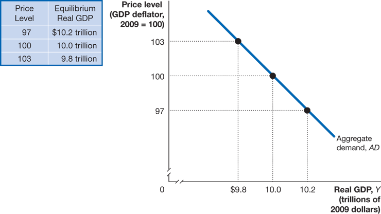
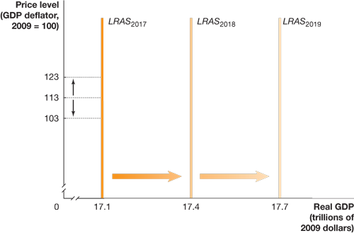
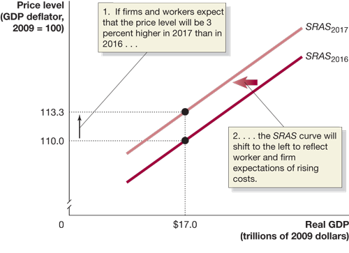
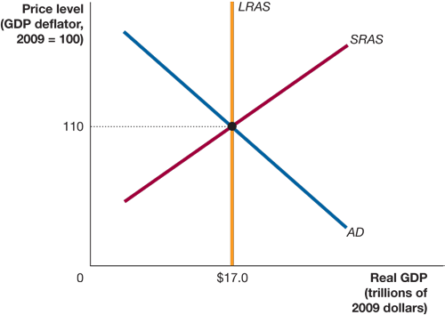
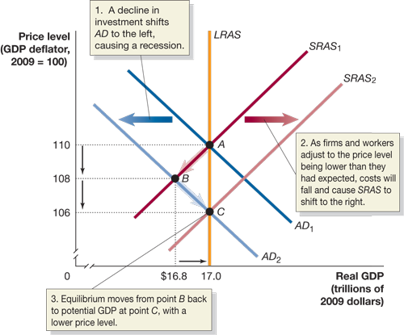
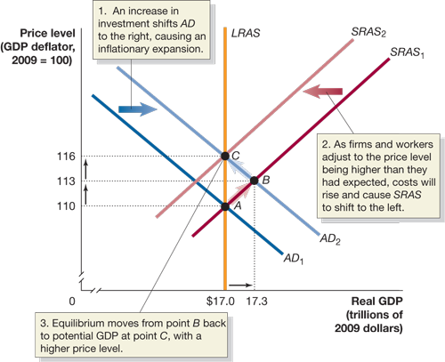
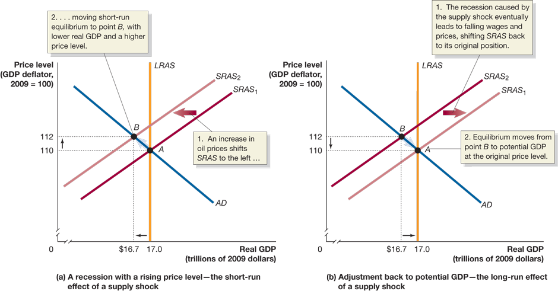
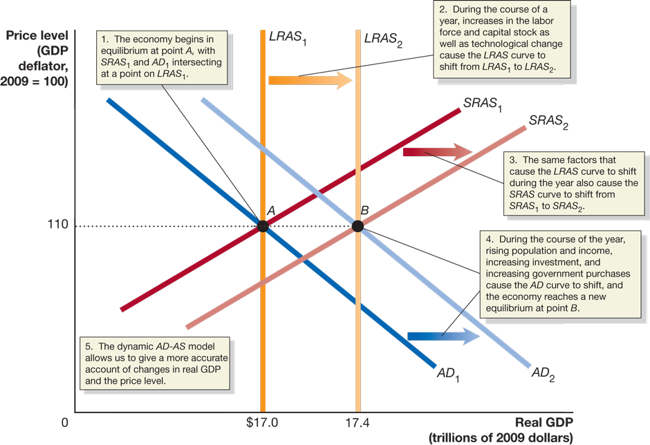
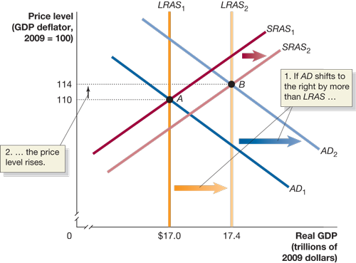
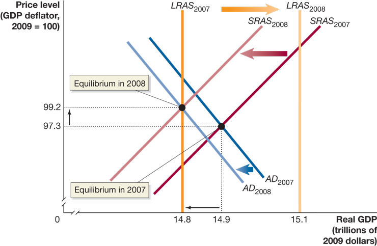

# Lecture 6: Aggregate Demand and Aggregate Supply Analysis

**Instructor:** Fei Tan

 @econdojo &nbsp;&nbsp;&nbsp;&nbsp;  @BusinessSchool101 &nbsp;&nbsp;&nbsp;&nbsp;  Saint Louis University

**Course:** Macroeconomics 201  
**Date:** September 22, 2025

---

## The Road Ahead

1. [Aggregate Demand](#aggregate-demand-revisited)
2. [Aggregate Supply](#aggregate-supply)
3. [Macroeconomic Equilibrium](#macroeconomic-equilibrium)
4. [Dynamic AD-AS Model](#dynamic-ad-as-model)

---

## Aggregate Demand Revisited

**Goods market equilibrium**

$$\underbrace{Y}_{\text{GDP}}=\underbrace{C+I+G+NX}_{\text{aggregate demand (AD)}}$$

- How AD depends on price level ($P$)

  - **wealth effect:** $P↑$ ⇒ real value of wealth ↓ ⇒ $C↓$
  - **interest-rate effect:** $P↑$ with unchanged $M^s$ ⇒ $i↑$ ⇒ $I↓$
  - **international-trade effect:** $P↑$ ⇒ EX ↓, IM ↑ ⇒ $NX↓$

- Inverse relation b/w price level and real GDP (AD curve)

---

## Aggregate Demand Curve Revisited

- Shifters of AD curve: monetary-fiscal policy, expectations of households/firms, foreign variables

---

## Aggregate Supply

- **Aggregate supply curve:** relation b/w price level and quantity of products firms are willing and able to supply

- **Long-run aggregate supply (LRAS) curve**

  - long-run real GDP depends on number of workers, technology level, capital stock, etc.
  - none of above are affected by price level

- **Short-run aggregate supply (SRAS) curve**

  - contracts make some wages "sticky"
  - menu costs make some prices "sticky"
  - SRAS curve slopes upward

---

## Long-Run Aggregate Supply Curve

- LRAS curve occurs at potential/full-employment GDP, advancing each year

---

## Short-Run Aggregate Supply Curve

- Shifters of SRAS curve: labor, capital, technology, expectations of future price level, supply shock

---

## Macroeconomic Equilibrium

- Static AD-AS model: no inflation, no growth
- Long-run equilibrium: short-run equilibrium occurs at potential GDP

---

## Effects of Decline in Aggregate Demand

- **Short-run:** recession (monetary & fiscal policy?)
- **Long-run:** lower price level (automatic mechanism)

---

## Effects of Increase in Aggregate Demand

- **Short-run:** expansion (monetary & fiscal policy?)
- **Long-run:** higher price level (automatic mechanism)

---

## Effects of Negative Supply Shock

- **Short-run:** stagflation—mix of inflation and recession (monetary & fiscal policy?)
- **Long-run:** same price level (automatic mechanism)

---

## Dynamic AD-AS Model

- Dynamic model allows for long-run growth

---

## Dynamic AD-AS Model (Cont'd)

- Dynamic model allows for inflation

---

## Recession of 2007-2009

- **Financial crisis:** housing bubble bursts ⇒ default on mortgage loan ⇒ credit crunch ⇒ C ↓, I ↓ ⇒ AD ←

- **(-) supply shock:** rising oil prices ⇒ SRAS ←

---

## Readings & Exercises

- Readings
  - HO: chapter 13
  - BJ: lecture 6

- Exercises
  - HO: problem 1.5, 2.5, 2.9, 3.5, 3.10, 4.6, D13.1