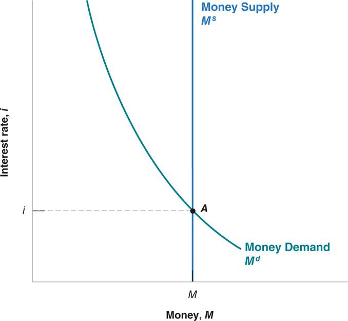

# Lecture 7: Money, Banks, and Federal Reserve System

**Instructor:** Fei Tan

 @econdojo &nbsp;&nbsp;&nbsp;&nbsp;  @BusinessSchool101 &nbsp;&nbsp;&nbsp;&nbsp;  Saint Louis University

**Course:** Macroeconomics 201  
**Date:** September 27, 2025

---

## The Road Ahead

1. [Money Supply and Demand](#what-is-money)
2. [How Do Banks Create Money](#bank-balance-sheet)
3. [Federal Reserve System](#federal-reserve-system)
4. [Quantity Theory of Money](#connecting-money-and-prices)

---

## What Is Money?

- Any asset accepted in exchange for goods and services or payments of debts, e.g. commodity/fiat money

  - narrow measure includes liquid/monetary assets

    

    $$\text{M1 = currency + checkable deposits}$$

    

  - broader measure includes less liquid/non-monetary assets, e.g. time deposits
  - M1 measures money supply ($M^s$), controlled by Fed

- **Why is it important**

  - by easing trading, money allows specialization that makes people more productive

- Functions of money: medium of exchange, unit of account, store of value, standard of deferred payment

---

## Measuring Money Supply

- Fed uses two measures of money supply: M1 & M2 (source: Fed Board of Governors)

---

## What Is Cryptocurrency?

- Decentralized digital money designed to be used over internet, e.g. Bitcoin, Ethereum, Dogecoin

  - transfer value online without a bank/payment processor
  - managed by peer-to-peer networks of computers
  - secured by blockchain—constantly re-verified ledger of all transactions, distributed over network

- **Why is it the future of finance**

  - buy goods/services or invest
  - not manipulated by central authority
  - equal opportunity to anyone with internet access

- Easiest way to acquire cryptocurrency is to purchase via online exchange, e.g. [Coinbase](https://www.coinbase.com)

---

## Bitcoin Daily Volume

---

## Demand for Money

**Money demand function**

$$M^d=\$Y\times L(i)$$

- Money demand ($M^d$) depends on two main factors

  - level of transactions, assumed to be proportional to nominal GDP ($\$Y$)
  - nominal interest rate ($i$) on bonds, hence **opportunity cost/price of holding money**

- Relation b/w bond price ($\$P_B$) and bond yield ($i$): assume one-year bond, face value = $100

$$i=\frac{\$100-\$P_B}{\$P_B}\times 100\%\quad\Rightarrow\quad\$P_B=\frac{\$100}{1+i}$$

---

## Financial Market Equilibrium

- Equilibrium requires money supply equal demand
- LM relation: $M^s=M^d$

---

## Effects of Higher Income

- $\$Y\uparrow$ ⇒ $M^d>M^s$ ⇒ $i\uparrow$ to restore equilibrium

---

## Effects of Higher Money Supply

- $M^s\uparrow$ ⇒ $M^d<M^s$ ⇒ $i\downarrow$ to restore equilibrium

---

## Bank Balance Sheet

**Assets = liabilities + net worth (capital/stockholder's equity)**

| Assets | | Liabilities and Net Worth | |
|--------|------|---------------------------|------|
| Reserves | $130 | Deposits | $1000 |
| Loans | $900 | Long-term debt | $700 |
| Securities | $700 | Net worth | $30 |

- Examples of assets

  - reserves: bank deposits in vault and with Fed (required reserve ratio (RR), excess reserves)
  - loans to consumers and firms

- Examples of liabilities

  - deposits, e.g. checking/saving accounts
  - long-term debt, e.g. bonds

---

## Example: Money Creation

**Bank of America T-account**

| Assets | | Liabilities | |
|--------|------|-------------|------|
| Reserves | +$100 | Deposits | +$1000 |
| Loans | +$900 | | |

- Tom deposits $1000 in currency at BoA
- with RR = 10%, BoA loans out $900 to Jerry

**Chase T-account**

| Assets | | Liabilities | |
|--------|------|-------------|------|
| Reserves | +$90 | Deposits | +$900 |
| Loans | +$810 | | |

- Jerry deposits $900 in currency at Chase
- with RR = 10%, Chase loans out $810 to Tom

---

## Simple Deposit Multiplier

| Bank | Change in deposits (D) |
|------|----------------------|
| Bank of America | +$1,000 |
| Chase | +$900 (=.9×$1,000) |
| Third Bank | +$810 (=.9×$900) |
| ⋮ | ⋮ |

- Example: RR=10%, initially Tom deposits $1000

- Calculate deposit multiplier

$$\Delta D=\$1000\times(1+.9+.9^2+.9^3+\cdots)$$
$$\Rightarrow\quad \text{multiplier}=\frac{1}{1-.9}=\frac{1}{\text{RR}}=10\quad\text{(why?)}$$

- Higher RR leads to lower multiplier

---

## Federal Reserve System

- Fractional banking system: banks keep less than 100% of deposits as reserves, hence subject to

  - bank run: depositors simultaneously withdraw money
  - bank panic: banks simultaneously experience runs

- Example: Federal reserve system

  - began operation in 1914 as lender of last resort to prevent panics
  - central bank in U.S., bankers' bank
  - make discount loans to banks, charge discount rate

- Federal Deposit Insurance Corporation (FDIC) established in 1934 to insure deposits up to $250,000

- Fed's monetary policy tools, e.g. open market operations, discount policy, reserve requirements

---

## Feedback Loop During Panic

---

## Federal Reserve System (Cont'd)

---

## Example: Open Market Purchase

**Banking system T-account**

| Assets | | Liabilities | |
|--------|------|-------------|------|
| Reserves | +$10 million | | |
| Treasury bills | -$10 million | | |

- Federal Open Market Committee (FOMC) directs purchase of $10 million Treasury bills from banks
- reserves ↑ ⇒ $M^s$↑ through deposit multiplier

**Federal Reserve T-account**

| Assets | | Liabilities | |
|--------|------|-------------|------|
| Treasury bills | +$10 million | Reserves | +$10 million |

- Fed deposits funds in reserve accounts for banks

- To decrease $M^s$, Fed conducts open market **sale**

---

## Connecting Money and Prices

**Quantity equation**

$$M\times V=P\times Y\quad\Rightarrow\quad g_M+g_V=g_P+g_Y$$

- Notations

  - $g_X$ = growth rate of variable $X$
  - $M$ = money supply, e.g. M1
  - $V$ = velocity of money
  - $P$ = price level, e.g. GDP deflator
  - $Y$ = real output, e.g. real GDP

- Quantity theory of money

  - assume constant $V$, giving **$\pi=g_M-g_Y$**
  - inflation occurs whenever $g_M>g_Y$

---

## Money Growth and Inflation

- (a) source: Friedman and Schwartz (1982), Fed Board, & BEA; Decades of higher money growth were often associated with higher inflation
- (b) source: IMF; Countries with higher money growth tend to have higher inflation

---

## Readings & Exercises

- Readings
  - HO: chapter 14
  - BJ: lecture 3 (sec. 1, 2) (supplementary)
  - [Bitcoin: A Peer-to-Peer Electronic Cash System](https://bitcoin.org/bitcoin.pdf)
  - [Ethereum Whitepaper](https://ethereum.org/en/whitepaper)
  - Tascha's [A Crash Course on Crypto Economics in 1 Hour](https://twitter.com/RealNatashaChe/status/1448419168986882050)

- Exercises
  - HO: problem 3.10, 3.12, D14.1, D14.2