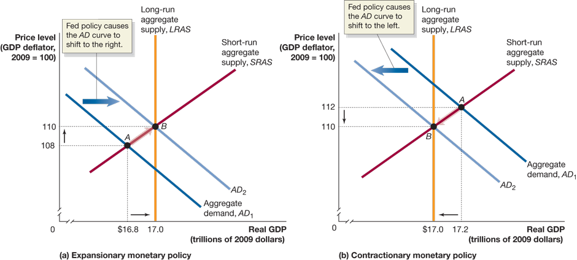

# Lecture 8: Monetary Policy

**Instructor:** Fei Tan

 @econdojo &nbsp;&nbsp;&nbsp;&nbsp;  @BusinessSchool101 &nbsp;&nbsp;&nbsp;&nbsp;  Saint Louis University

**Course:** Macroeconomics 201  
**Date:** October 6, 2025

---

## The Road Ahead

1. [What Is Monetary Policy](#what-is-monetary-policy)
2. [Money Market and Federal Funds Rate](#money-market-equilibrium-revisited)
3. [Monetary Policy and Economic Activity](#effects-of-monetary-policy)

---

## What Is Monetary Policy?

- Federal reserve system
  
  - established in 1914 as lender of last resort to prevent panics
  - central bank in U.S., bankers' bank
  - make discount loans to banks, charge discount rate

- Nowadays Fed manages policy targets (money supply & interest rates) to achieve macro objectives
  
  - dual mandate: price stability & high employment
  - stability of financial markets & institutions
  - long-run economic growth

- Fed's conventional policy tools, e.g. open market operations, discount policy, reserve requirements

---

## Money Market Equilibrium Revisited

- $M^s\uparrow$ ⇒ $M^d<M^s$ ⇒ $i\downarrow$ to restore equilibrium

- Short-term nominal rate v.s. long-term real rate

---

## Federal Funds Rate

- Interest rate banks charge each other for overnight loans

- Target rate (Fed) v.s. effective rate (federal funds market)

- Open market purchase (sale) ⇒ reserves supply $\uparrow$ ($\downarrow$) ⇒ effective rate $\downarrow$ ($\uparrow$) ⇒ other short/long-term rates $\downarrow$ ($\uparrow$)

---

## Effects of Monetary Policy

- Expansionary (contractionary) monetary policy
  
  - $i\downarrow$ ($\uparrow$) ⇒ borrowing cost $\downarrow$ ($\uparrow$) ⇒ $C,I\uparrow$ ($\downarrow$)
  - $i\downarrow$ ($\uparrow$) ⇒ $ depreciates (appreciates) ⇒ $NX\uparrow$ ($\downarrow$)

- AD curve shifts to right (left)

---

## Effects of Monetary Policy (Cont'd)

- Expansionary/loose monetary policy to fight recession

---

## Effects of Monetary Policy (Cont'd)

- Contractionary/tight monetary policy to fight inflation

---

## Monetary Policy Rule

### Taylor rule

$$i_t^*=r_n+\pi_t+a(\pi_t-\pi^*)-b(u_t-u_n)$$

$$\Rightarrow\quad i_t^*=r_n+\pi^*+\color{red}(a+1)\color{black}(\pi_t-\pi^*)-b(u_t-u_n)$$

Some remarks

- suggested by John Taylor for setting target rate $i_t^*$
- $r_n$: natural real rate, consistent w/ potential GDP
- $\pi_t-\pi^*$: gap b/w inflation and target
- $u_t-u_n$: gap b/w unemployment and natural rate
- counter-cyclical policy: $a>0$ and $b>0$
- Taylor principle: $\pi_t\uparrow$ ⇒ $i_t^*\uparrow$ more than one for one

---

## Readings & Exercises

- Readings
  
  - HO: chapter 15
  - BJ: lecture 20 (supplementary)

- Exercises
  
  - HO: problem 1.2, 2.5, 3.6, 4.4, 4.5, D15.2
  - Write down Taylor rule and discuss how it explains implementation of monetary policy.