# Lecture 9: Fiscal Policy

**Instructor:** Fei Tan

 @econdojo &nbsp;&nbsp;&nbsp;&nbsp;  @BusinessSchool101 &nbsp;&nbsp;&nbsp;&nbsp;  Saint Louis University

**Course:** Macroeconomics 201  
**Date:** October 25, 2025

---

## The Road Ahead

1. [What Is Fiscal Policy](#what-is-fiscal-policy)
2. [Budget Deficit and National Debt](#federal-government-debt)
3. [Short-Run Fiscal Policy and Economic Activity](#effects-of-short-run-fiscal-policy)
4. [Fiscal Multipliers and Crowding Out](#fiscal-multipliers)
5. [Long-Run Fiscal Policy and Economic Growth](#effects-of-long-run-fiscal-policy)

---

## What Is Fiscal Policy?

### Government budget constraint

$$\underbrace{B_t-B_{t-1}}_{\text{deficits in year }t}=\underbrace{rB_{t-1}}_{\text{interest payments}}+\underbrace{G_t-T_t}_{\text{primary deficit}}$$

$$\Rightarrow\quad B_t=(1+r)B_{t-1}+G_t-T_t$$

- Some remarks

    - deficit (flow, $B_t-B_{t-1}$) v.s. debt (stock, $B_t$)
    - evolution of debt-to-GDP ratio

    

    $$\underbrace{\frac{B_t}{Y_t}-\frac{B_{t-1}}{Y_{t-1}}}_{\text{change in debt ratio}}=(r-g)\underbrace{\frac{B_{t-1}}{Y_{t-1}}}_{\text{initial debt ratio}}+\underbrace{\frac{G_t-T_t}{Y_t}}_{\text{primary deficit ratio}}$$

    

- Fiscal policy (changes in $(G_t,T_t)$ to achieve macro objectives) v.s. automatic stabilizer

---

## Federal Government Expenditures, 2016

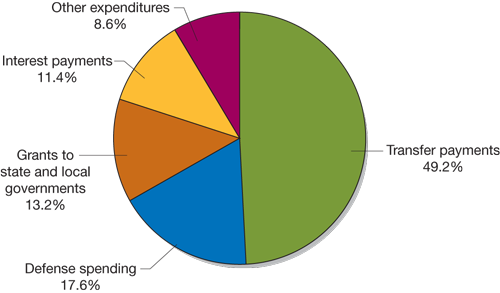

- Federal government purchases v.s. expenditures

---

## Federal Government Revenue, 2016

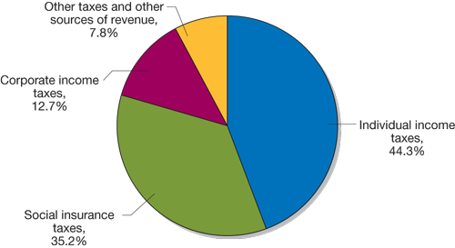

- Social Security and Medicare programs funded by payroll taxes

---

## Three Largest Transfer Programs

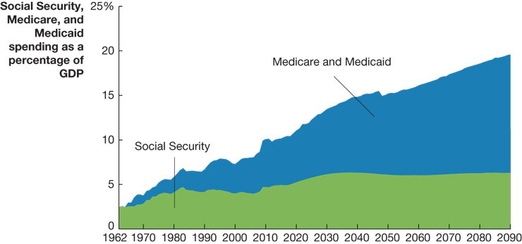

- Source: Congressional Budget Office (CBO)
- *Social Security*: payments to retired/disabled workers
- *Medicare*: health care coverage to people age 65+
- *Medicaid*: medical care to low-income people

---

## Federal Budget Deficit

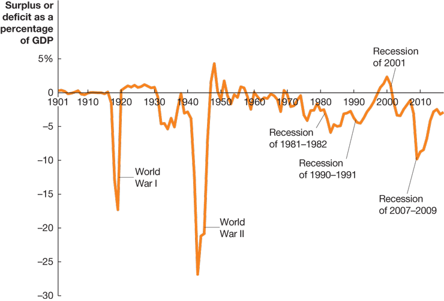

- Deficits rise during wartime and recessions (source: BEA)
- Actual deficit = cyclically adjusted (FP) + automatic stabilizer
- Should federal budget always be balanced?

---

## Federal Government Debt

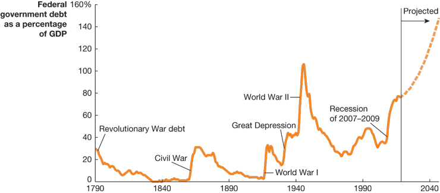

- Total value of U.S. Treasury bonds (source: Bureau of Census)
- Budget deficit (surplus) ⇒ debt $\uparrow$ ($\downarrow$) ⇒ crowding-out effect
- High debt hinders long-run economic growth

---

## Effects of Short-Run Fiscal Policy

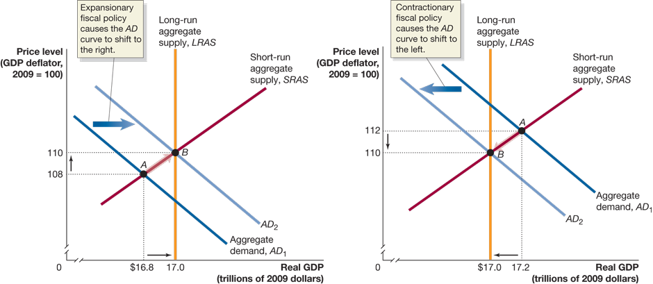

- Expansionary (contractionary) fiscal policy, e.g., President Obama's stimulus package
  
  - $G\uparrow$ ($\downarrow$), $T\downarrow$ ($\uparrow$) ⇒ $Y\uparrow$ ($\downarrow$) ⇒ $M^d\uparrow$ ($\downarrow$) ⇒ $i\uparrow$ ($\downarrow$)
  - $i\uparrow$ ($\downarrow$) ⇒ crowding-out effect: $C,I,NX\downarrow$ ($\uparrow$)

- AD curve shifts to right (left)

---

## Effects of Short-Run Fiscal Policy (Cont'd)

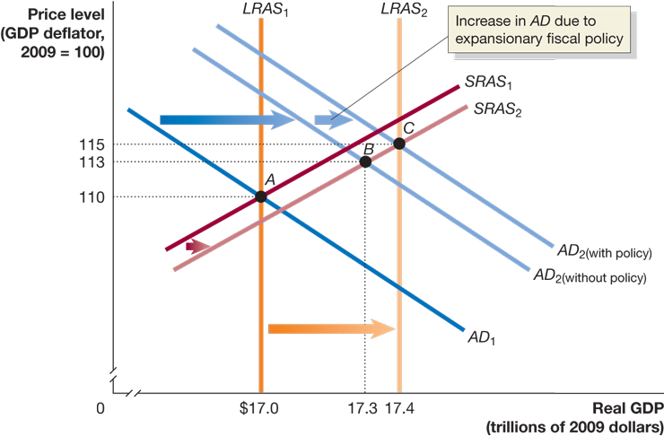

- Expansionary fiscal policy to fight recession

---

## Effects of Short-Run Fiscal Policy (Cont'd)

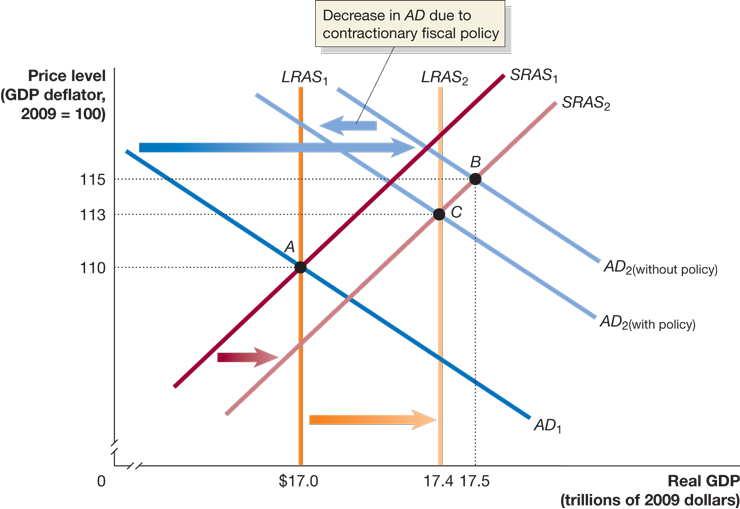

- Contractionary fiscal policy to fight inflation

---

## Fiscal Multipliers

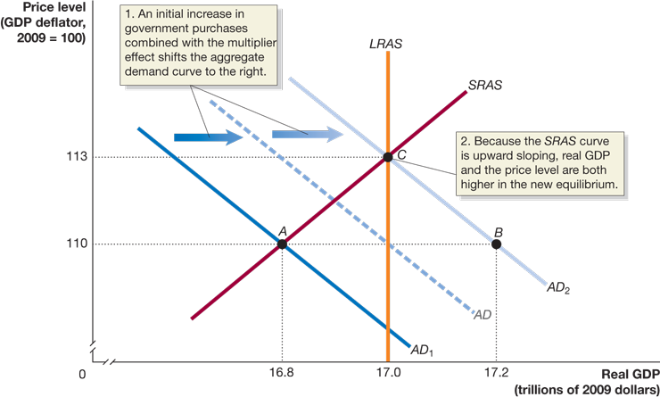

- Given $\Delta G=-\Delta T$ and constant $P$, $\Delta Y/\Delta G>-\Delta Y/\Delta T$
- Rising price level partly offsets multiplier effect

---

## Effects of Crowding Out

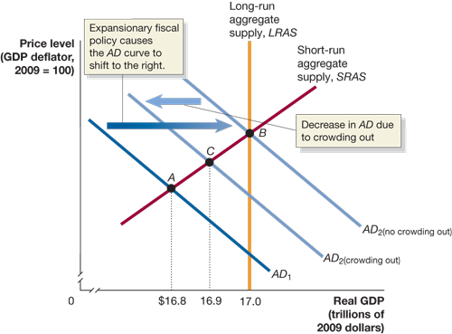

- $G\uparrow$ ⇒ $Y\uparrow$ ⇒ $M^d>M^s$ ⇒ $i\uparrow$ ⇒ $C\downarrow$, $I\downarrow$, $NX\downarrow$
- Short-run partial v.s. long-run complete crowding out

---

## Effects of Long-Run Fiscal Policy

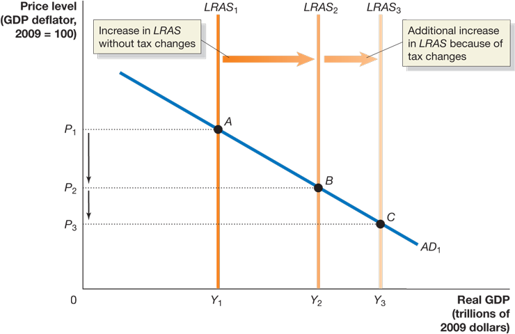

- Effects of tax reduction (or simplification), e.g., President Trump's tax reform: $T\downarrow$ ⇒ $N\uparrow$, $S=I\uparrow$, $K\uparrow$ ⇒ $g_Y\uparrow$
- LRAS curve shifts to right

---

## Readings & Exercises

- Readings
  
  - HO: chapter 16
  - BJ: lecture 19 (supplementary)

- Exercises
  
  - HO: problem 1.5, 2.4, 2.5, 3.5, 4.6, D16.2
  - Derive evolution of debt-to-GDP ratio from government budget constraint and explain how to reduce it.